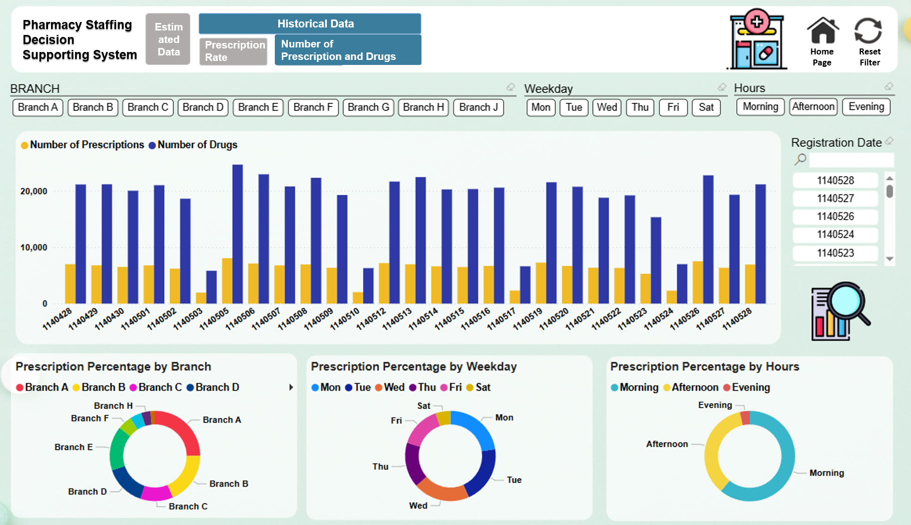

# powerbi-pharmacy-staffing-dashboard

This project presents a Power BI decision support system designed to optimize outpatient pharmacy staffing based on real-time and historical data.  
It helps decision-makers determine appropriate pharmacist headcount across different time slots by forecasting the remaining prescription workload.

---

## 📌 Project Overview

Pharmacy staffing decisions often suffer from unpredictability and underutilization of historical data.  
This dashboard integrates historical trends, real-time outpatient volume, and predictive analytics to support timely and data-driven staffing adjustments, aiming to avoid over- or under-staffing.

---

## 🧰 Features

- **Historical Trend Analysis**  
  Analyzes prescription and medication counts over the past 30 days to calculate:
  - Consultation rate  
  - Prescription issuance rate  
  - Average number of medication items per prescription (by physician/department)

- **Real-Time Monitoring**  
  Displays the number of patients currently in progress and those waiting to be seen, reflecting up-to-date outpatient demand.

- **Forecasting Engine**  
  Estimates the number of pending prescriptions and medication items by multiplying:
  - Each physician’s historical 30-day average:
    - Consultation rate  
    - Prescription rate  
    - Average number of drugs per prescription  
  - × Real-time number of patients yet to complete consultation

- **Decision Support Dashboard**  
  Visualizes:
  - Forecasted prescription workload vs. current staffing levels  
  - Summaries of departments, clinics, or physicians with higher-than-average prescription or medication volume  
  - Breakdown by time period, branch, weekday, clinic, physician, and department

- **Efficiency Gains**  
  Enables faster and more accurate pharmacist staffing decisions, reducing idle time and overtime while maintaining service quality.

---

## 🧱 Tech Stack

| Tool          | Purpose                          |
|---------------|----------------------------------|
| SQL Server    | Historical data extraction       |
| ETL Tools     | Data pipeline and transformation |
| Power BI      | Dashboard development            |
| DAX           | Forecast logic and metrics       |

---

## 📈 Workflow Overview

1. **Requirements Gathering**  
2. **Data Mart Construction**  
3. **ETL Workflow Design**  
4. **Dashboard Development**  
5. **Deployment and Stakeholder Training**

---

## 📊 Dashboard Screenshots

| Real-time + Forecast Dashboard |  
|:--|  
|  |

| KPI Breakdown (Branch, Weekday, Time Period) |  
|:--|  
|  |

| Physician- and Clinic-Level Insights |  
|:--|  
|  |

---

## 🧩 KPI Definitions

| Metric                           | Description |
|----------------------------------|-------------|
| Consultation Rate                | % of registered patients who completed consultation |
| Prescription Rate                | % of patients who received prescriptions |
| Avg. Drugs per Prescription      | Average number of drugs prescribed per prescription |
| Pending Prescriptions Today      | Estimated number of prescriptions to be dispensed |
| Pending Drugs Today              | Estimated number of drugs to be dispensed |

---

## 🔒 Privacy Notes

All visualizations are based on anonymized and aggregated data.  
The dashboard is intended for internal operational support and contains no personally identifiable patient information.
