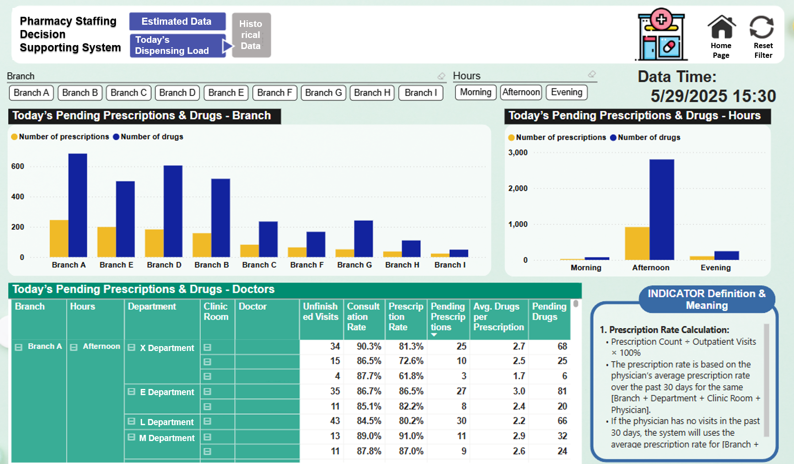
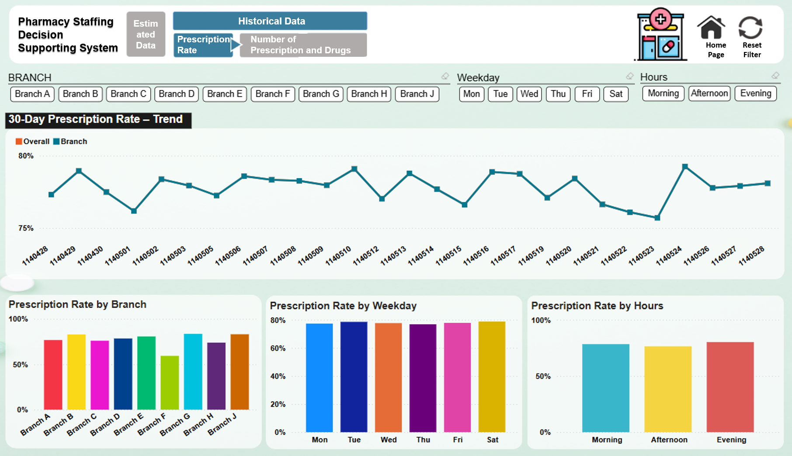

# powerbi-pharmacy-staffing-dashboard

This project presents a Power BI decision support system designed to optimize outpatient pharmacy staffing based on real-time and historical data.  
It helps decision-makers determine appropriate pharmacist headcount across different time slots by forecasting the remaining prescription workload.

---

## 📌 Project Overview

Pharmacy staffing decisions often suffer from unpredictability and underutilization of historical data.  
This dashboard integrates historical trends, real-time outpatient volume, and predictive analytics to support timely and data-driven staffing adjustments, aiming to avoid over- or under-staffing.

---

## 🧰 Features

- **Historical Trend Analysis**  
  Analyzes prescription and medication counts over the past 30 days to calculate:
  - Prescription issuance rate
  - Average number of prescriptions and medication items per visit (by physician/department)

- **Real-Time Monitoring**  
  Displays current outpatient counts and unfinished visits to reflect ongoing demand.

- **Forecasting Engine**  
  Predicts remaining prescription volume and item count using:
  - Past 30-day physician-level data
  - Real-time outpatient queue
  - Visit-patient matching logic

- **Decision Support Dashboard**  
  Visualizes:
  - Forecasted workload vs. staffing levels
  - Outlier physicians/departments with high prescription complexity
  - Department- and branch-specific summaries

- **Efficiency Gains**  
  Enables faster and more accurate staffing adjustments, reducing both idle time and overtime.

---

## 🧱 Tech Stack

| Tool          | Purpose                          |
|---------------|----------------------------------|
| SQL Server    | Historical data extraction       |
| ETL Tools     | Data pipeline and transformation |
| Power BI      | Dashboard development            |
| DAX           | Forecast logic and metrics       |

---

## 📈 Workflow Overview

1. **Requirements Gathering** → 2. **Data Mart Construction** → 3. **ETL Workflow Design**  
4. **Dashboard Development** → 5. **Deployment and Stakeholder Training**

---

## 📊 Dashboard Screenshots

|  |   
|  |   
|  |   

---

## 🧩 KPI Definitions

| Metric                           | Description |
|----------------------------------|-------------|
| Prescription Rate                | % of patients who received prescriptions |
| Today’s Dispensing Prescriptions | Expected # of prescriptions not yet dispensed |
| Today’s Dispensing Drugs         | Expected # of items in those prescriptions |

---

## 🔒 Privacy Notes

All data has been anonymized and aggregated before visualization.  
The system is designed for internal operational improvement and does not contain personally identifiable patient information.
